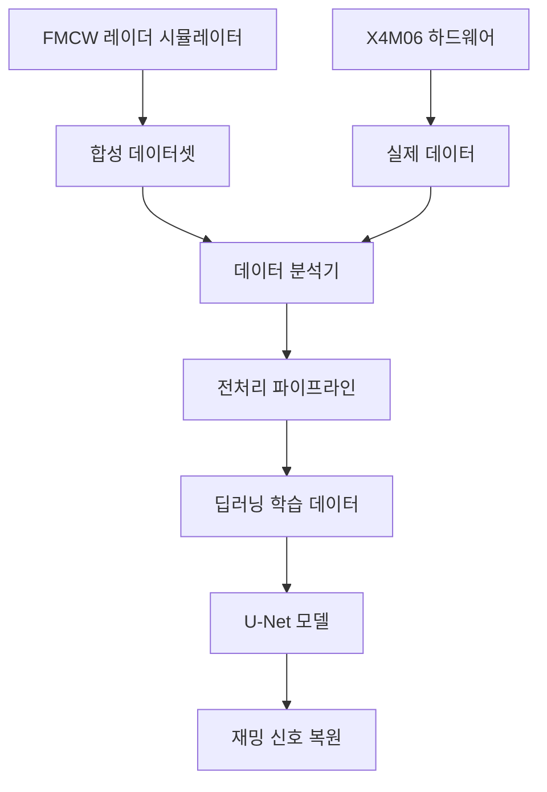
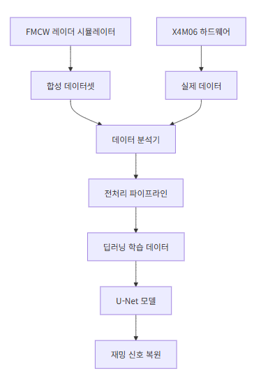

# X4M06 레이더 재밍 신호 복원 연구 - 실험 코드 기술문서

## 📋 목차
1. [개요](#개요)
2. [시스템 아키텍처](#시스템-아키텍처)
3. [코드 구조](#코드-구조)
4. [실험 환경 설정](#실험-환경-설정)
5. [사용법](#사용법)
6. [API 문서](#api-문서)
7. [실험 절차](#실험-절차)
8. [데이터 포맷](#데이터-포맷)
9. [문제해결](#문제해결)

---

## 개요

본 실험 코드는 자율주행 레이더의 재밍 환경에서의 신호 복원을 위한 딥러닝 모델 개발에 필요한 데이터셋 구축 및 분석 도구를 제공합니다.

### 🎯 주요 목적
- **합성 데이터셋 생성**: FMCW 레이더 신호 모델링 및 재밍 시뮬레이션
- **실제 데이터 수집**: X4M06 하드웨어를 통한 실험 데이터 획득
- **데이터 분석**: 신호 품질 분석 및 재밍 패턴 분석
- **전처리 파이프라인**: 딥러닝 모델 학습용 데이터 준비

### 🔬 연구 배경
- **문제**: 차량 레이더 간 상호 간섭으로 인한 유령 표적 생성 및 탐지 성능 저하
- **해결책**: U-Net 기반 딥러닝 모델을 통한 재밍 신호 제거 및 원본 신호 복원
- **기여**: 실시간 처리 가능한 강인한 레이더 신호 복원 기술 개발

---

## 시스템 아키텍처






### 📁 주요 구성요소

| 구성요소 | 파일명 | 기능 |
|---------|-------|------|
| **시뮬레이터** | `jamming_simulator.py` | FMCW 레이더 및 재밍 신호 모델링 |
| **데이터 수집** | `x4m06_data_collector.py` | X4M06 하드웨어 제어 및 데이터 수집 |
| **데이터 분석** | `data_analyzer.py` | 신호 분석 및 품질 평가 |
| **메인 문서** | `X4M06_레이더_분석_리포트.md` | 종합 분석 보고서 |

---

## 코드 구조

### 1. jamming_simulator.py

#### 🏗️ 클래스 구조
```python
class FMCWRadarSimulator:
    """FMCW 레이더 신호 시뮬레이터"""
    - generate_clean_signal()      # 깨끗한 레이더 신호 생성
    - generate_jammed_signal()     # 재밍 신호 추가
    - _generate_target_echo()      # 목표물 에코 신호 생성
    - _generate_jamming_signal()   # 재밍 신호 생성

class SpectrogramGenerator:
    """스펙트로그램 생성 클래스"""
    - generate_spectrogram()       # STFT 기반 스펙트로그램 생성
    - normalize_spectrogram()      # 정규화 (0-1 범위)

class DatasetGenerator:
    """합성 데이터셋 생성 클래스"""
    - generate_dataset()           # 대규모 데이터셋 생성
    - visualize_samples()          # 샘플 시각화
```

#### ⚙️ 주요 파라미터
```python
radar_config = {
    'center_freq': 8.748e9,        # 중심 주파수 (X4M06 호환)
    'bandwidth': 1.4e9,            # 대역폭
    'chirp_duration': 1e-3,        # 처프 지속시간
    'sampling_rate': 1e6,          # 샘플링 주파수
    'num_jammers': [1, 5],         # 재머 개수 범위
    'jammer_power_ratio': [0.5, 2.0], # 재머 전력비
}
```

### 2. x4m06_data_collector.py

#### 🔌 하드웨어 연동
```python
class X4M06DataCollector:
    """X4M06 레이더 데이터 수집 클래스"""
    - connect()                    # 레이더 모듈 연결
    - start_streaming()            # 데이터 스트리밍 시작
    - read_frame()                 # 단일 프레임 읽기
    - collect_data_batch()         # 배치 데이터 수집

class ExperimentController:
    """실험 제어 및 데이터 관리"""
    - run_baseline_experiment()    # 베이스라인 실험
    - run_multi_radar_simulation() # 다중 레이더 시뮬레이션
```

#### 🎛️ 레이더 설정
```python
config = {
    'dac_min': 900, 'dac_max': 1150,
    'iterations': 16,              # 평균화 횟수
    'pulses_per_step': 26,         # 스텝당 펄스 수
    'frame_area_start': 0.5,       # 시작 거리 (m)
    'frame_area_end': 5.0,         # 끝 거리 (m)
    'fps': 20,                     # 프레임율
    'downconversion': 1,           # 베이스밴드 모드
}
```

### 3. data_analyzer.py

#### 📊 분석 기능
```python
class RadarDataAnalyzer:
    """레이더 데이터 분석 클래스"""
    - analyze_signal_statistics()   # 신호 통계 분석
    - analyze_frequency_spectrum()  # 주파수 스펙트럼 분석
    - compare_clean_vs_jammed()     # 깨끗한 vs 재밍 신호 비교

class DataPreprocessor:
    """딥러닝 모델용 데이터 전처리"""
    - preprocess_for_training()     # 학습용 데이터 전처리
    - apply_data_augmentation()     # 데이터 증강
```

---

## 실험 환경 설정

### 💻 시스템 요구사항
- **OS**: Windows 10/11, Linux, macOS
- **Python**: 3.6 이상
- **RAM**: 8GB 이상 권장
- **저장공간**: 5GB 이상 (대규모 데이터셋용)

### 📦 필수 패키지 설치
```bash
# 기본 패키지
pip install numpy matplotlib scipy h5py tqdm pandas scikit-learn opencv-python seaborn

# 시리얼 통신 (하드웨어 연동 시)
pip install pyserial

# X4M06 모듈 커넥터 설치
cd "ModuleConnector-win32_win64-1/python36-win64"
python setup.py install
```

### 🔧 하드웨어 설정 (선택사항)
1. **X4M06 모듈 연결**
   - USB-Serial 어댑터를 통해 PC와 연결
   - 적절한 드라이버 설치

2. **COM 포트 확인**
   ```python
   import serial.tools.list_ports
   ports = list(serial.tools.list_ports.comports())
   for port in ports:
       print(f"{port.device}: {port.description}")
   ```

---

## 사용법

### 🚀 빠른 시작

#### 1단계: 합성 데이터셋 생성
```bash
python jamming_simulator.py
```

**출력**:
- `synthetic_dataset/radar_jamming_dataset_1000.h5`: 합성 데이터셋
- `synthetic_dataset/metadata_1000.json`: 메타데이터
- `synthetic_dataset/sample_visualization.png`: 시각화 결과

#### 2단계: 데이터 분석
```bash
python data_analyzer.py
```

**출력**:
- `analysis_results/`: 분석 결과 디렉토리
- `analysis_results/analysis_report.json`: 종합 분석 보고서
- 각종 시각화 파일들

#### 3단계: 실제 데이터 수집 (하드웨어 있는 경우)
```bash
python x4m06_data_collector.py
```

### 📝 코드 예제

#### 합성 데이터 생성 예제
```python
from jamming_simulator import FMCWRadarSimulator, DatasetGenerator, SpectrogramGenerator

# 시뮬레이터 초기화
radar_sim = FMCWRadarSimulator()
spec_gen = SpectrogramGenerator()
dataset_gen = DatasetGenerator(radar_sim, spec_gen, "output_dir")

# 데이터셋 생성
dataset_file = dataset_gen.generate_dataset(num_samples=5000)
```

#### 실제 데이터 수집 예제
```python
from x4m06_data_collector import X4M06DataCollector, ExperimentController

# 데이터 수집기 초기화
collector = X4M06DataCollector("COM3")
experiment = ExperimentController()

# 베이스라인 실험
baseline_file = experiment.run_baseline_experiment(collector, num_frames=1000)
```

#### 데이터 분석 예제
```python
from data_analyzer import RadarDataAnalyzer

# 분석기 초기화
analyzer = RadarDataAnalyzer()

# 데이터셋 로드 및 분석
data = analyzer.load_dataset("dataset.h5")
stats = analyzer.analyze_signal_statistics(data['clean_signals'], "Clean")
```

---

## API 문서

### FMCWRadarSimulator

#### `__init__(config=None)`
FMCW 레이더 시뮬레이터 초기화

**Parameters:**
- `config` (dict, optional): 레이더 파라미터 설정

#### `generate_clean_signal(num_targets=1, target_params=None)`
재밍이 없는 깨끗한 목표 신호 생성

**Parameters:**
- `num_targets` (int): 목표물 개수
- `target_params` (list): 목표물 파라미터 리스트

**Returns:**
- `tuple`: (시간 도메인 신호, 목표물 파라미터)

#### `generate_jammed_signal(clean_signal, target_params=None)`
재밍 신호가 추가된 오염된 신호 생성

**Parameters:**
- `clean_signal` (np.ndarray): 깨끗한 신호
- `target_params` (list): 목표물 파라미터

**Returns:**
- `tuple`: (재밍된 신호, 재밍 파라미터)

### X4M06DataCollector

#### `connect()`
X4M06 레이더 모듈에 연결

**Returns:**
- `bool`: 연결 성공 여부

#### `start_streaming(fps=None)`
데이터 스트리밍 시작

**Parameters:**
- `fps` (int, optional): 프레임율

**Returns:**
- `bool`: 스트리밍 시작 성공 여부

#### `read_frame()`
단일 프레임 데이터 읽기

**Returns:**
- `np.ndarray` or `None`: 프레임 데이터

#### `collect_data_batch(num_frames, timeout=30)`
배치 데이터 수집

**Parameters:**
- `num_frames` (int): 수집할 프레임 수
- `timeout` (int): 타임아웃 (초)

**Returns:**
- `np.ndarray` or `None`: 수집된 데이터

### RadarDataAnalyzer

#### `load_dataset(dataset_path, dataset_type='hdf5')`
데이터셋 로드

**Parameters:**
- `dataset_path` (str): 데이터셋 파일 경로
- `dataset_type` (str): 데이터셋 타입

**Returns:**
- `dict`: 로드된 데이터

#### `analyze_signal_statistics(signals, label="")`
신호 통계 분석

**Parameters:**
- `signals` (np.ndarray): 신호 데이터
- `label` (str): 분석 라벨

**Returns:**
- `dict`: 통계 분석 결과

---

## 실험 절차

### 📋 표준 실험 프로토콜

#### Phase 1: 시뮬레이션 기반 데이터셋 구축
1. **환경 설정**
   ```bash
   # 출력 디렉토리 설정
   mkdir synthetic_dataset experiment_data analysis_results
   ```

2. **파라미터 튜닝**
   - 레이더 파라미터 조정 (주파수, 대역폭, 전력 등)
   - 재밍 시나리오 설정 (재머 개수, 전력비, 주파수 오프셋)
   - 목표물 특성 정의 (거리, 속도, RCS)

3. **대규모 데이터셋 생성**
   ```python
   # 10,000개 샘플 생성 (예시)
   dataset_gen.generate_dataset(num_samples=10000, save_format='hdf5')
   ```

4. **데이터 품질 검증**
   - 신호 통계 분석
   - 주파수 스펙트럼 확인
   - SNR 분포 검사

#### Phase 2: 하드웨어 검증 실험
1. **하드웨어 설정**
   - X4M06 모듈 연결 및 초기화
   - 통신 상태 확인
   - 파라미터 설정 검증

2. **베이스라인 측정**
   ```python
   # 재밍 없는 환경에서의 기준 데이터
   baseline_data = experiment.run_baseline_experiment(collector, num_frames=1000)
   ```

3. **시나리오별 실험**
   - 근거리/중거리/원거리 탐지
   - 단일/다중 목표물
   - 정적/동적 목표물

4. **데이터 수집 및 저장**
   - HDF5 형식으로 구조화된 저장
   - 메타데이터 포함 (실험 조건, 시간 등)

#### Phase 3: 데이터 분석 및 전처리
1. **종합 분석**
   ```python
   # 시뮬레이션 vs 실제 데이터 비교
   analyzer.compare_clean_vs_jammed(synthetic_data, real_data)
   ```

2. **전처리 파이프라인**
   - STFT 기반 스펙트로그램 생성
   - 정규화 및 리사이징
   - 데이터 증강

3. **품질 보증**
   - 이상치 탐지 및 제거
   - 클래스 불균형 확인
   - 교차 검증용 데이터 분할

### 🔍 실험 검증 방법

#### 데이터 품질 지표
- **SNR**: > 15 dB (권장)
- **동적 범위**: > 40 dB
- **상관계수**: 깨끗한 vs 재밍 신호 < 0.8
- **주파수 대역폭**: 설계 사양 대비 ±5% 이내

#### 시각적 검증
- 스펙트로그램 패턴 확인
- 시간/주파수 영역 신호 품질
- 재밍 패턴 식별 가능성

---

## 데이터 포맷

### 📊 HDF5 데이터셋 구조
```
radar_jamming_dataset_N.h5
├── clean_spectrograms     # Shape: (N, freq_bins, time_bins)
├── jammed_spectrograms    # Shape: (N, freq_bins, time_bins)  
├── clean_signals          # Shape: (N, samples)
├── jammed_signals         # Shape: (N, samples)
└── metadata/
    ├── creation_date
    ├── radar_config
    └── sample_info
```

### 📋 메타데이터 형식 (JSON)
```json
{
    "creation_date": "2025-09-26T15:30:00",
    "radar_config": {
        "center_freq": 8748000000,
        "bandwidth": 1400000000,
        "sampling_rate": 1000000
    },
    "samples": [
        {
            "sample_id": 0,
            "target_params": [(5.2, -15.3, 2.1)],
            "jammer_params": [...]
        }
    ]
}
```

### 📈 실험 데이터 형식
```
experiment_data/
├── baseline_data_YYYYMMDD_HHMMSS.h5
├── scenario_close_range_YYYYMMDD_HHMMSS.h5
├── scenario_medium_range_YYYYMMDD_HHMMSS.h5
└── experiment_metadata.json
```

---

## 문제해결

### 🚨 일반적인 문제들

#### 1. 모듈 연결 실패
**증상**: `ModuleConnector` 초기화 실패
```
Error: pymoduleconnector not available
```

**해결방법**:
1. pymoduleconnector 설치 확인
   ```bash
   cd ModuleConnector-win32_win64-1/python36-win64
   python setup.py install
   ```

2. COM 포트 확인
   ```python
   import serial.tools.list_ports
   ports = list(serial.tools.list_ports.comports())
   print("Available ports:", [p.device for p in ports])
   ```

3. 드라이버 설치 확인 (장치 관리자)

#### 2. 메모리 부족 오류
**증상**: 대용량 데이터셋 생성 시 메모리 오류
```
MemoryError: Unable to allocate array
```

**해결방법**:
1. 배치 크기 줄이기
   ```python
   # 한 번에 적은 샘플 생성
   for batch in range(0, total_samples, batch_size):
       dataset_gen.generate_dataset(batch_size)
   ```

2. HDF5 스트리밍 모드 사용
3. 데이터 압축 옵션 활용

#### 3. 스펙트로그램 생성 오류
**증상**: STFT 계산 실패
```
ValueError: Input signal length is too short
```

**해결방법**:
1. 신호 길이 확인
2. STFT 파라미터 조정
   ```python
   stft_params = {
       'nperseg': min(256, len(signal)//4),
       'noverlap': min(128, len(signal)//8)
   }
   ```

#### 4. 데이터 로드 실패
**증상**: HDF5 파일 읽기 오류
```
OSError: Unable to open file
```

**해결방법**:
1. 파일 경로 확인
2. 파일 권한 확인
3. HDF5 라이브러리 버전 호환성 검사
   ```bash
   pip install --upgrade h5py
   ```

### 🔧 성능 최적화

#### CPU 최적화
```python
# 멀티프로세싱 사용
from multiprocessing import Pool
import multiprocessing as mp

def process_signal_batch(signals):
    # 병렬 처리 로직
    pass

if __name__ == '__main__':
    with Pool(mp.cpu_count()) as pool:
        results = pool.map(process_signal_batch, signal_batches)
```

#### 메모리 최적화
```python
# 메모리 맵 사용
import numpy as np

# 대용량 배열을 디스크에 저장하고 메모리 맵으로 접근
large_array = np.memmap('temp_data.dat', dtype='float32', 
                       mode='w+', shape=(10000, 1000))
```

#### I/O 최적화
```python
# HDF5 압축 사용
with h5py.File('dataset.h5', 'w') as f:
    f.create_dataset('data', data=large_data, 
                    compression='gzip', compression_opts=9)
```

### 🏥 디버깅 도구

#### 로깅 설정
```python
import logging

logging.basicConfig(
    level=logging.INFO,
    format='%(asctime)s - %(name)s - %(levelname)s - %(message)s',
    handlers=[
        logging.FileHandler('radar_experiment.log'),
        logging.StreamHandler()
    ]
)

logger = logging.getLogger(__name__)
```

#### 프로파일링
```python
import cProfile
import pstats

# 성능 프로파일링
cProfile.run('your_function()', 'profile_stats')
stats = pstats.Stats('profile_stats')
stats.sort_stats('cumulative').print_stats(20)
```

---

## 📞 지원 및 문의

### 🆘 기술 지원
- **GitHub Issues**: [프로젝트 저장소](https://github.com/your-repo/x4m06-radar)
- **이메일**: support@your-domain.com
- **문서 업데이트**: 정기적으로 최신 버전 확인

### 📚 추가 자료
- [X4M06 공식 문서](https://www.novelda.com)
- [FMCW 레이더 이론](https://example.com/fmcw-theory)
- [딥러닝 기반 신호 처리](https://example.com/dl-signal)

---

**작성일**: 2025년 9월 26일  
**버전**: 1.0  
**작성자**: AI 레이더 연구팀